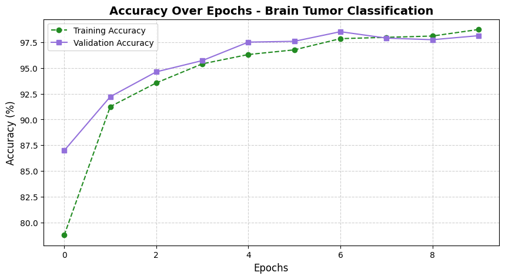
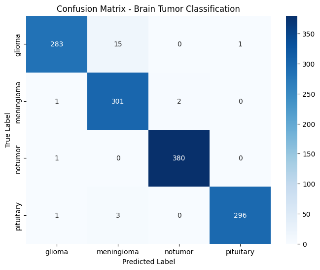
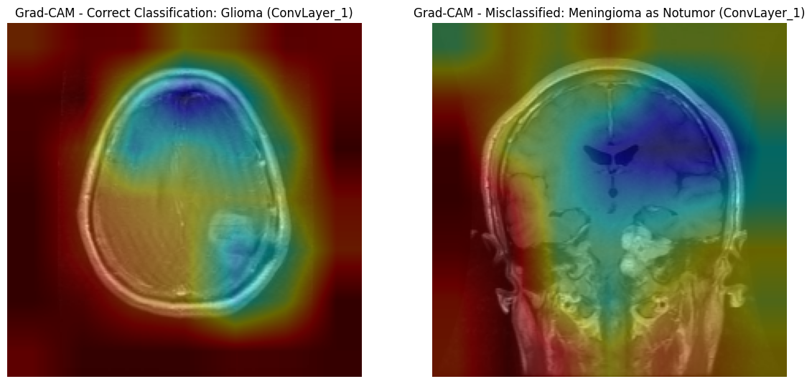

## Dataset

This project uses the public Brain Tumor MRI Dataset from Kaggle (Masoud Nickparvar), which contains 7,023 MRI images across four classes: glioma, meningioma, pituitary, and no tumor.
- [Data Source: Brain Tumor MRI Dataset (Kaggle)](https://www.kaggle.com/datasets/masoudnickparvar/brain-tumor-mri-dataset)

Before training, I removed 218 duplicate images (191 training, 27 test) using MD5 hashing, leaving 5,521 training images and 1,284 test images.

## Python Code

- [View Brain Tumor MRI Classification Notebook](https://github.com/kvellian/brain_tumor_mri/blob/main/assets/path/CSC578_KenVellian_FinalProject.ipynb)

## Purpose

This project aims to classify brain MRI scans into four classes and explain what the model looks at when it makes a prediction. The goal is a model that is both accurate and inspectable, since a black-box prediction is hard to trust in a clinical setting.

## Method

- **Preprocessing:** resized images to 224x224, applied ImageNet normalization, and augmented the training set with horizontal flips, 10 degree rotations, and color jitter.
- **Model:** fine-tuned a ResNet50 pretrained on ImageNet (PyTorch). All layers were frozen except the last residual block (layer4), with a new classification head (2048 to 256, ReLU, Dropout 0.4, 4 outputs).
- **Training:** cross-entropy loss, Adam with weight decay, a step learning-rate schedule, and early stopping. Trained on a Colab T4 GPU; training stopped after 10 epochs.
- **Explainability:** applied Grad-CAM and LIME to see which regions of the scan drove each prediction.

## Results

The model reached **98% accuracy and 0.98 macro F1 on 1,284 test images**.

| Class | Precision | Recall | F1 |
|---|---|---|---|
| Glioma | 0.99 | 0.95 | 0.97 |
| Meningioma | 0.94 | 0.99 | 0.97 |
| No tumor | 0.99 | 1.00 | 1.00 |
| Pituitary | 1.00 | 0.99 | 0.99 |

Grad-CAM showed that the model sometimes attended to surrounding tissue rather than the tumor itself, which is a useful check on what the accuracy number does and does not mean.

## Notes

The test set was also used for early stopping, so the 98% figure is not a fully independent holdout result. A separate validation split would be the next improvement.

Course: CSC 578 Neural Networks and Deep Learning, DePaul University (Winter 2025).
